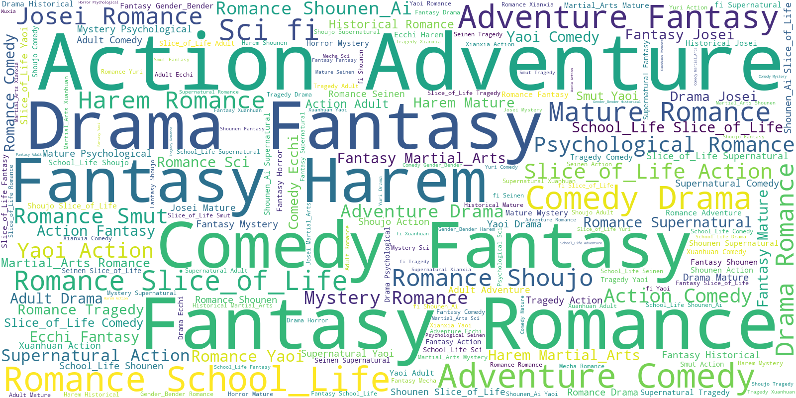

# Novelupdates Dataset

### Dataset Summary

This dataset contains information about webnovels from Novelupdates, a popular webnovel platform. It includes details such as novel ID, URL, title, associated names, cover image URL, show type, genres, tags, description, related series, recommendations, recommendation lists, rating, language, authors, artists, year, status, licensing information, translation status, publishers, release frequency, rankings, total reading list rank, and chapters.

### Supported Tasks and Leaderboards

The dataset can be used for various tasks such as text classification, zero-shot classification, and feature extraction. It currently does not have an established leaderboard.

### Languages

The dataset is primarily in English.

## Dataset Structure

### Data Instances

The dataset contains 14,713 data instances.

### Data Fields

The dataset includes the following fields:

- novel_id: integer
- url: string
- title: string
- associated_names: list of strings
- img_url: string
- showtype: string
- genres: list of strings
- tags: list of strings
- description: string
- related_series: struct
  - related_series: list of structs
    - title: string
    - url: string
  - total: integer
- recommendations: struct
  - recommendations: list of structs
    - recommended_user_count: integer
    - title: string
    - url: string
  - total: integer
- recommendation_lists: struct
  - list: list of structs
    - title: string
    - url: string
  - total: integer
- rating: string
- language: string
- authors: list of strings
- artists: list of strings
- year: string
- status_coo: string
- licensed: string
- translated: string
- publishers: list of strings
- en_pubs: list of strings
- release_frequency: string
- weekly_rank: string
- monthly_rank: string
- all_time_rank: string
- monthly_rank_reading_list: string
- all_time_rank_reading_list: string
- total_reading_list_rank: string
- chapters: struct
  - chapters: list of structs
    - title: string
    - url: string
  - total: integer

## Dataset Creation

### Curation Rationale

The dataset was curated to provide a comprehensive collection of webnovel information from Novelupdates for various text analysis tasks.

### Source Data

### Annotations

#### Annotation process

The dataset does not contain explicit annotations. It consists of the information available on the Novelupdates website.

#### Who are the annotators?

N/A

### Personal and Sensitive Information

The dataset does not include any personal or sensitive information.
